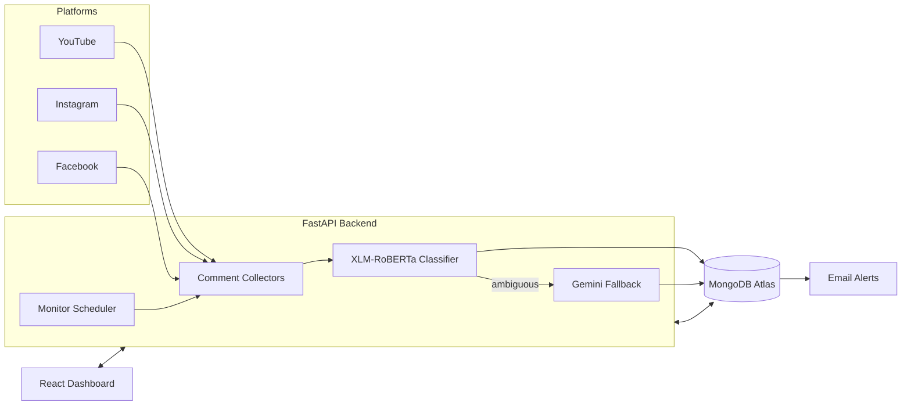

<div align="center">

# 🛡️ Women Safety AI

**Real-time AI moderation that watches your YouTube, Instagram & Facebook comments — so you don't have to.**

[](https://www.python.org/)
[](https://fastapi.tiangolo.com/)
[](https://react.dev/)
[](https://www.docker.com/)
[](https://k3s.io/)
[](https://www.jenkins.io/)
[](https://www.mongodb.com/atlas)

</div>

---

## 📖 Overview

**Women Safety AI** is an end-to-end platform that monitors comments on a creator's **YouTube videos**, **Instagram posts**, and **Facebook posts** in real time, automatically classifies them for harassment, threats, and hate speech using a fine-tuned transformer model, and instantly alerts the creator (and, if configured, an NGO/authority contact) by email when something unsafe is detected — with a full analytics dashboard to review every incident.

The project is also built as a complete, portfolio-grade **DevOps pipeline**: containerized with Docker, orchestrated with Kubernetes (k3s), and deployed automatically through a Jenkins CI/CD pipeline onto a production AWS server with free HTTPS.

## ✨ Features

- **Multi-platform monitoring** — YouTube, Instagram, and Facebook comments polled and analyzed live
- **5-category AI classification** — Safe, Offensive, Sexual Harassment, Threat, Hate Speech
- **LLM escalation fallback** — ambiguous cases are re-checked by Gemini for a second opinion before an alert fires
- **Secure OAuth login** — Google (YouTube) and Meta (Instagram + Facebook share one login)
- **Automatic incident alerts** — instant email notification the moment an unsafe comment is detected, with duplicate-alert protection
- **Live analytics dashboard** — real-time incident feed, per-category charts, and monitoring controls per video/post
- **Production-grade infrastructure** — Dockerized services, Kubernetes deployments, automated CI/CD, HTTPS out of the box

## 🏗️ Architecture



## 🧰 Tech Stack

| Layer | Technology |
|---|---|
| **AI Model** | XLM-RoBERTa (fine-tuned), PyTorch, HuggingFace Transformers, Gemini API (fallback) |
| **Backend** | FastAPI, Uvicorn, PyMongo |
| **Frontend** | React 19, Vite |
| **Database** | MongoDB (Atlas in production) |
| **Auth** | Google OAuth 2.0, Meta (Facebook Login) OAuth |
| **Containers** | Docker (multi-stage builds) |
| **Orchestration** | Kubernetes (k3s) |
| **CI/CD** | Jenkins (automated build → push → deploy pipeline) |
| **Infra** | AWS EC2, Nginx, Let's Encrypt (via nip.io), MongoDB Atlas |

## 📊 Model Performance

Fine-tuned XLM-RoBERTa classifier evaluated on a held-out multilingual test set:

**Overall accuracy: 87.49%** (weighted F1: 0.876)

| Category | Precision | Recall | F1-score | Support |
|---|---|---|---|---|
| Safe | 0.946 | 0.915 | 0.930 | 6,782 |
| Offensive | 0.670 | 0.758 | 0.711 | 1,340 |
| Sexual Harassment | 0.886 | 0.936 | 0.910 | 1,396 |
| Threat | 0.800 | 0.889 | 0.842 | 406 |
| Hate Speech | 0.763 | 0.718 | 0.740 | 1,322 |

Cases where the local model's confidence is low are automatically escalated to a Gemini LLM fallback chain for a second opinion before an incident is logged.

## 📁 Project Structure

```
WomenSafetyAI/
├── ai_model/            # Model training, evaluation, prediction, LLM fallback
├── backend/              # FastAPI app: OAuth, routes, monitor scheduler
├── database/             # MongoDB access layer
├── email_service/        # Incident alert emails
├── social_media/         # Platform-specific comment collectors (YT/IG/FB)
├── language_detection/   # Language identification utilities
├── translation/          # Translation utilities for multilingual comments
├── frontend/             # React + Vite dashboard
├── dataset/              # Training/eval data pipeline scripts
├── saved_models/         # Trained model weights + evaluation reports
├── deployment/
│   ├── docker/           # Dockerfiles for backend, frontend, Jenkins agent
│   ├── k8s/               # Kubernetes manifests (Deployments, Services)
│   └── docker-compose.yml # Local multi-service stack
├── Jenkinsfile           # CI/CD pipeline: build → push → deploy
└── requirements.txt
```

## 🚀 Getting Started (Local Development)

### Prerequisites
- Python 3.12+
- Node.js 20+
- MongoDB (local or Atlas connection string)

### Backend
```bash
python -m venv .venv
source .venv/bin/activate        # Windows: .venv\Scripts\activate
pip install -r requirements.txt
cp .env.example .env             # fill in your credentials, see below
python -m uvicorn backend.main:app --reload
```

### Frontend
```bash
cd frontend
npm install
npm run dev
```

The dashboard runs at `http://localhost:5173`, proxying API calls to the backend at `http://localhost:8000`.

## 🔑 Environment Variables

All required variables (Google OAuth, Meta App credentials, MongoDB URI, Gemini API keys, email SMTP settings) are documented with setup instructions in [`.env.example`](.env.example). Copy it to `.env` and fill in your own values — never commit `.env`.

## 📦 Deployment

This project ships with a full containerized, orchestrated, and automated deployment path:

1. **Docker** — `deployment/docker/*.Dockerfile` build lean backend and frontend images (CPU-only PyTorch, model weights mounted at runtime rather than baked in)
2. **Kubernetes (k3s)** — `deployment/k8s/*.yaml` define Deployments + Services for both apps, with health probes and resource limits tuned for a single-node cluster
3. **Jenkins CI/CD** — the [`Jenkinsfile`](Jenkinsfile) automates the full pipeline: build both images → push to Docker Hub → roll out to the cluster with zero manual steps
4. **Production** — served over HTTPS (Let's Encrypt via nip.io) behind Nginx, with MongoDB Atlas as the database

```bash
# Local multi-service stack (Docker Compose)
docker compose -f deployment/docker-compose.yml up --build
```

## 👤 Author

**Krishna Kankanampati** — [github.com/krishnakankanampati](https://github.com/krishnakankanampati)
